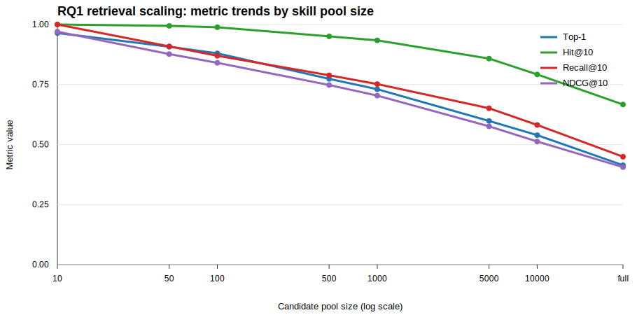

# RQ1 正式实验分析：Skill Library 规模对检索准确率的影响

**日期**：2026-07-09  
**研究问题**：RQ1 - Skill library size 增大时，skill retrieval accuracy 是否下降？  
**实验脚本**：`experiments/rq1_retrieval_scaling.py`  
**输出目录**：`data/experiments/rq1_retrieval_scaling/`

---

## 1. 结论摘要

正式 RQ1 实验支持我们的核心假设：**当 candidate skill pool 从 10 扩大到 full library 时，BM25 skill retrieval 的准确率明显下降**。

主要结果：

- Top-1 Accuracy 从 **0.964** 下降到 **0.414**，绝对下降 **0.550**。
- Hit@10 从 **1.000** 下降到 **0.667**，说明即使允许 Top-10，full library 下仍有约三分之一任务找不到任何 gold skill。
- Recall@10 从 **1.000** 下降到 **0.449**，说明多 gold-skill 任务中，Top-10 对完整 gold set 的覆盖率也显著下降。
- Full library 下，87 个任务中只有 **36 个**任务 Top-1 命中；有 **29 个**任务 Top-10 内没有任何 gold skill。

因此，RQ1 的当前答案是：**是的，在随机 distractor 设置下，skill library 规模增大会显著降低检索准确率。**

---

## 2. 实验设置

### 数据

- 数据集：Skill-Usage
- Query 来源：`data/raw/Skill-Usage/data/task_queries.json`
- Gold skill 来源：`data/raw/Skill-Usage/data/task_skill_mapping.json`
- Skill pool 来源：`data/raw/Skill-Usage/skills-34k/skills_meta.jsonl`
- Skill 总数：34,396
- 任务数：87

### Candidate Pool

候选池大小：

| Pool label | Actual size |
|---:|---:|
| 10 | 10 |
| 50 | 50 |
| 100 | 100 |
| 500 | 500 |
| 1000 | 1000 |
| 5000 | 5000 |
| 10000 | 10000 |
| full | 34396 |

每个任务的 candidate pool 都强制包含该任务的 gold skills，其余位置用 random distractors 填充。非 full 档位每档重复 20 次随机采样；full library 档位不采样，只运行 1 次。

### Retriever

本实验使用轻量本地 BM25，检索文本为：

```text
skill name + skill description
```

这个设置刻意保持简单，目的是先观察 library size 本身对基础 retrieval 的影响。后续 RQ3 会比较 dense retriever、hybrid retriever 和 reranker。

BM25 ranking 会返回 Top-K 个候选，包括零分候选。这样可以避免小 candidate pool 中因为只有少量正分文档而低估 Hit@K / Recall@K。脚本同时在 per-query 输出中记录 `positive_score_count` 和 `returned_count`，用于区分“真正有词重叠的候选数”和“补齐后的 Top-K 返回数”。

### Metrics

- **Top-1 Accuracy**：排名第一的 skill 是否命中任一 gold skill。
- **Hit@K**：Top-K 中是否至少包含一个 gold skill。
- **Recall@K**：Top-K 命中的 gold skill 数 / gold skill 总数。
- **MRR@10**：Top-10 内第一个 gold skill 的 reciprocal rank。
- **NDCG@10**：Top-10 排序质量。

这里的 Recall@K 是 gold set coverage，不是 Hit@K。因此在多 gold-skill 任务中，Recall@10 低于 Hit@10 是正常现象。

---

## 3. 主要结果



| Pool size | Top-1 | Hit@10 | Recall@10 | MRR@10 | NDCG@10 |
|---:|---:|---:|---:|---:|---:|
| 10 | 0.964 | 1.000 | 1.000 | 0.980 | 0.970 |
| 50 | 0.907 | 0.994 | 0.909 | 0.942 | 0.877 |
| 100 | 0.880 | 0.989 | 0.870 | 0.921 | 0.840 |
| 500 | 0.774 | 0.951 | 0.788 | 0.842 | 0.748 |
| 1000 | 0.730 | 0.934 | 0.752 | 0.802 | 0.704 |
| 5000 | 0.598 | 0.858 | 0.651 | 0.677 | 0.576 |
| 10000 | 0.539 | 0.792 | 0.582 | 0.619 | 0.513 |
| full | 0.414 | 0.667 | 0.449 | 0.507 | 0.406 |

### Accuracy degradation

从 pool size 10 到 full：

| Metric | Pool=10 | Full | Absolute drop | Full / Pool=10 |
|---|---:|---:|---:|---:|
| Top-1 Accuracy | 0.964 | 0.414 | 0.550 | 0.429 |
| Hit@10 | 1.000 | 0.667 | 0.333 | 0.667 |
| Recall@10 | 1.000 | 0.449 | 0.551 | 0.449 |
| MRR@10 | 0.980 | 0.507 | 0.473 | 0.518 |
| NDCG@10 | 0.970 | 0.406 | 0.564 | 0.418 |

Top-1 保留率只有 42.9%，说明 full library 下第一名结果经常被 random distractor 挤掉。Hit@10 的保留率更高，为 66.7%，说明 Top-10 仍能缓解部分检索失败，但不能完全解决大规模候选池带来的噪声。

---

## 4. 失败案例观察

Full library 下：

- Top-1 错误：51 / 87
- Top-10 完全 miss：29 / 87
- Top-1 命中：36 / 87
- Top-10 至少命中一个 gold skill：58 / 87

Top-10 miss 的任务包括：

- `court-form-filling`
- `crystallographic-wyckoff-position-analysis`
- `data-to-d3`
- `econ-detrending-correlation`
- `enterprise-information-search`
- `financial-modeling-qa`
- `manufacturing-equipment-maintenance`
- `mario-coin-counting`
- `multilingual-video-dubbing`
- `pdf-excel-diff`

这些任务通常有较强领域词汇或复合操作需求。仅使用 skill name + description 的 BM25 容易被表面词重叠的 distractors 干扰，也可能无法捕捉 query 与 skill procedural content 之间的语义关系。

完整失败案例见：

- `data/experiments/rq1_retrieval_scaling/full_pool_error_cases.json`

---

## 5. 解释与启示

### 5.1 Larger library introduces retrieval competition

在小候选池中，gold skill 与少量 random distractors 竞争，BM25 很容易把 gold skill 排到前面。但当 pool 扩大到几万条时，很多非 gold skill 会共享 query 中的关键词，导致 gold skill 的排序被稀释。

### 5.2 Top-K helps, but does not eliminate the problem

Hit@10 明显高于 Top-1，说明让 Agent 查看多个候选 skill 可以缓解第一名错误。但 full library 下 Hit@10 仍只有 0.667，这意味着仅靠扩大 Top-K 不能保证正确 skill 被检索出来。

### 5.3 Random distractors are already enough to cause degradation

本实验只使用 random distractors，还没有加入 same-category、same-repo、lexical-overlap 或 semantic-near hard negatives。由于 random distractors 已经造成明显下降，后续更困难的 distractor 设置很可能会进一步放大 retrieval degradation。

### 5.4 RQ1 supports the broader project thesis

结果说明，skills 的数量增加并不自动转化为 agent 能力提升。更大的 skill library 同时增加了检索搜索空间、错误候选数量和排序竞争。Agent 是否能受益于更多 skills，首先受限于 retrieval layer 能否稳定找到正确 skill。

---

## 6. 当前限制

- Retriever 只使用 BM25，没有比较 dense/hybrid/reranker。
- Skill 表示只使用 name + description，没有读取完整 `SKILL.md` 内容。
- Distractor 类型目前是 random；hard negative 设置留给 RQ2。
- 当前实验评估 retrieval，不直接评估 downstream task completion。
- Full library 档位只有 1 次运行，因为不涉及随机采样；非 full 档位使用 20 次重复。

---

## 7. 下一步

1. **RQ2**：加入 same-owner、same-repo、lexical-overlap 和 semantic-near distractors，比较哪类 distractor 最容易导致错误检索。
2. **RQ3**：比较 BM25、dense embedding、hybrid retrieval 和 reranker。
3. **Error analysis**：人工抽样分析 full library 的 Top-10 miss 案例，标注错误来源。
4. **Downstream validation**：在小规模任务上比较 gold skill、retrieved skill、wrong skill 和 no skill 的完成率。

---

## 8. Reproducibility

复现实验：

```bash
python3 experiments/rq1_retrieval_scaling.py
```

主要输出：

- `data/experiments/rq1_retrieval_scaling/summary.csv`
- `data/experiments/rq1_retrieval_scaling/summary.json`
- `data/experiments/rq1_retrieval_scaling/repeat_summary.csv`
- `data/experiments/rq1_retrieval_scaling/per_query_metrics.csv`
- `data/experiments/rq1_retrieval_scaling/ranking_examples.json`
- `data/experiments/rq1_retrieval_scaling/full_pool_error_cases.json`
- `data/experiments/rq1_retrieval_scaling/metric_trends.svg`
