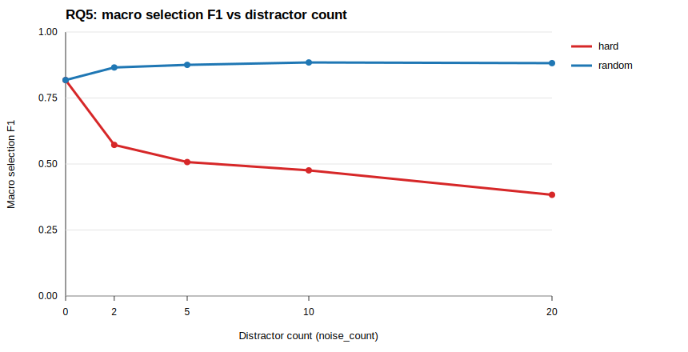
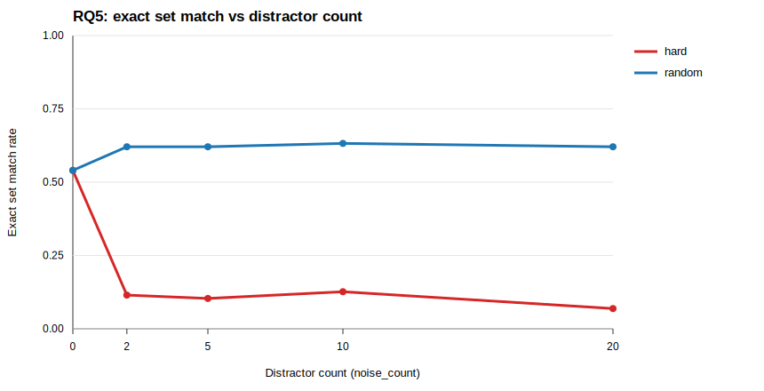
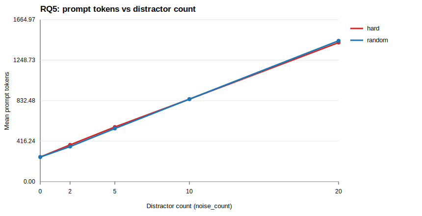

# RQ5 Results: Decision-Budget Stress Test for LLM Skill Routing

- **Script**: `experiments/rq5_llm_router_decision_budget.py`
- **Readme**: `docs/rq5_decision_budget/readme.md`
- **Output directory**: `data/experiments/rq5_llm_router/`

---

## 1. Run Log

| Step | Date | Command | Outcome |
|---|---|---|---|
| Step 1: dry run | 2026-07-20 | `python3 experiments/rq5_llm_router_decision_budget.py --dry-run` | 87 tasks, 783 planned conditions; wrote `experiment_metadata.json`, `experiment_plan.csv`, `candidate_menus.jsonl`; MiniLM doc embeddings cached |
| Step 2: 10-task pilot | 2026-07-20 | `python3 experiments/rq5_llm_router_decision_budget.py --limit-tasks 10 --api-key-prompt` | 10 tasks, 90/90 API calls, all `parse=ok`, no retries; macro F1 (hard, n=20) = 0.421 |
| Step 3: full run | 2026-07-20 | `python3 experiments/rq5_llm_router_decision_budget.py --resume --api-key-prompt` | 87 tasks, 783/783 conditions completed, all `parse=ok`, invalid rate 0.0, no early stop; wrote `per_condition_results.csv`, `summary.csv`, `summary.json`, `case_studies.json`, 3 SVG plots |

---

## 2. Pilot Decision Record (frozen once, never revised)

Noise-grid adjustment rule (proposal Section 6), applied to the pilot `hard, n=20` macro F1:

- **Pilot macro F1 (hard, n=20)**: 0.421
- **Rule branch matched**: otherwise (< 0.85)
- **Final frozen grid**: keep `{0, 2, 5, 10, 20}`
- **Recorded in `experiment_metadata.json` on**: 2026-07-20

Pilot calls under a superseded grid (if any) are reported separately as pilot data. The pilot ran on the original grid, so no pilot calls are superseded.

### Pilot summary (10 tasks, not the main dataset)

| type | n | macro F1 | exact | recall | extra | tokens |
|---|---|---|---|---|---|---|
| hard | 0 | 0.894 | 0.600 | 0.835 | 0.00 | 204 |
| hard | 2 | 0.686 | 0.200 | 0.835 | 0.90 | 314 |
| hard | 5 | 0.598 | 0.100 | 0.835 | 1.60 | 500 |
| hard | 10 | 0.524 | 0.100 | 0.835 | 2.70 | 768 |
| hard | 20 | 0.421 | 0.100 | 0.815 | 4.50 | 1348 |
| random | 0 | 0.894 | 0.600 | 0.835 | 0.00 | 204 |
| random | 2 | 0.894 | 0.600 | 0.835 | 0.00 | 305 |
| random | 5 | 0.894 | 0.600 | 0.835 | 0.00 | 467 |
| random | 10 | 0.894 | 0.600 | 0.835 | 0.00 | 791 |
| random | 20 | 0.908 | 0.600 | 0.855 | 0.00 | 1377 |

**Pilot observations** (preliminary, 10 tasks):

- **Random distractors have essentially no effect**: macro F1 stays at 0.894 from n=0 to n=20 with zero extra selections; the router filters obviously irrelevant skills reliably.
- **Hard distractors drive the degradation**: macro F1 falls 0.894 -> 0.421 as n grows 0 -> 20, almost entirely via over-selection (extra rate 0 -> 4.5) rather than gold misses (recall stays ~0.835 -> 0.815).
- **Recall is capped below 1.0 even at n=0** (0.835): some gold skills are not selected even with no distractors present (e.g. `adaptive-cruise-control` selected 3/5 at n=0), suggesting a task-intrinsic gold-coverage ceiling independent of noise.
- **Extreme case**: `court-form-filling` hard n=20 selected 17/21 candidates, indicating near-total confusion under semantically similar distractors.
- Prompt tokens grow ~linearly with n (~57-60 tokens per distractor).

---

## 3. Main Results (full run)

Source: `data/experiments/rq5_llm_router/summary.csv`, `summary.json`.

### 3.1 Selection quality vs distractor count

| type | n | macro F1 | exact set match | recall | mean extra skills | mean prompt tokens |
|---|---|---|---|---|---|---|
| random | 0 | 0.818 | 0.540 | 0.752 | 0.00 | 253 |
| random | 2 | 0.866 | 0.621 | 0.810 | 0.00 | 361 |
| random | 5 | 0.876 | 0.621 | 0.821 | 0.00 | 546 |
| random | 10 | 0.885 | 0.632 | 0.837 | 0.03 | 848 |
| random | 20 | 0.882 | 0.621 | 0.843 | 0.07 | 1448 |
| hard | 0 | 0.818 | 0.540 | 0.752 | 0.00 | 253 |
| hard | 2 | 0.572 | 0.115 | 0.688 | 1.23 | 378 |
| hard | 5 | 0.507 | 0.103 | 0.710 | 2.30 | 561 |
| hard | 10 | 0.476 | 0.126 | 0.721 | 3.53 | 847 |
| hard | 20 | 0.383 | 0.069 | 0.656 | 5.31 | 1430 |

All 783 responses parsed successfully (`invalid_response_rate = 0` in every cell). n=0 is a single shared baseline duplicated into both curves.

**Findings**:

- **Hard distractors cause severe, monotonic degradation**: macro F1 falls 0.818 -> 0.383 (n=0 -> 20) and exact set match collapses 0.540 -> 0.069. The damage is dominated by over-selection (`mean_extra_skill_count` 0 -> 5.31; `any_wrong_selection_rate` 0 -> 0.897), with a smaller recall erosion (0.752 -> 0.656).
- **Random distractors are harmless — even mildly helpful**: macro F1 stays flat or slightly rises (0.818 -> 0.882 at n=20), extra selections stay near zero (max 0.07), and recall *improves* 0.752 -> 0.843. Contrasting irrelevant options appears to help the router commit to gold skills it would otherwise omit.
- **The random-hard gap widens with n**: F1 gap is 0.29 at n=2 and 0.50 at n=20, confirming that distractor *hardness*, not count per se, is the binding constraint on routing quality.
- **Baseline is imperfect even with zero noise**: at n=0 the router misses ~0.90 gold skills per task on average (recall 0.752, exact match 0.540), an under-selection ceiling independent of distractors.

### 3.2 Token / latency cost

- **Prompt tokens grow linearly with n**: ~253 tokens at n=0 to ~1430-1448 at n=20, i.e. **~59-60 tokens per extra distractor**, identical for both distractor types (menu length is the driver).
- **Completion tokens diverge by type**: hard menus also inflate output (8.3 -> 39.4 completion tokens as the router selects more skills), while random menus stay near-constant (8.3 -> 12.5).
- **Latency rises modestly**: median latency 2.82s at n=0 to 3.65s (hard) / 3.01s (random) at n=20; p90 up to 5.75s (hard n=20).
- **Cost-accuracy tradeoff**: under hard distractors, spending 5.6x more prompt tokens (n=0 -> 20) buys *worse* accuracy — the extra context is pure liability. Under random distractors the extra tokens are cost-neutral for accuracy.

### 3.3 Paired-bootstrap contrasts

Source: `summary.json` (`paired_bootstrap_contrasts`), 87 paired tasks each.

| Contrast | Metric | Delta | 95% CI | Significant? |
|---|---|---|---|---|
| hard n=20 vs n=0 | selection F1 | -0.435 | [-0.503, -0.367] | Yes |
| random n=20 vs n=0 | selection F1 | +0.064 | [+0.034, +0.096] | Yes (positive) |
| hard vs random, n=5 | selection F1 | -0.368 | [-0.424, -0.313] | Yes |
| hard vs random, n=10 | selection F1 | -0.409 | [-0.471, -0.347] | Yes |
| hard vs random, n=20 | selection F1 | -0.499 | [-0.559, -0.438] | Yes |

All five pre-specified contrasts exclude zero. The hard-vs-random gap grows monotonically with n; the small positive random n=20 effect matches the recall improvement noted in 3.1.

### 3.4 Single-gold sensitivity subgroup (pre-specified)

26 of 87 tasks have exactly one gold skill (`single_gold_sensitivity` in `summary.json`):

| type | n | correct selection | wrong selection | refusal |
|---|---|---|---|---|
| both | 0 | 1.000 | 0.000 | 0.000 |
| random | 2-20 | 1.000 | 0.000 | 0.000 |
| hard | 2 | 0.231 | 0.769 | 0.000 |
| hard | 5 | 0.154 | 0.846 | 0.000 |
| hard | 10 | 0.192 | 0.808 | 0.000 |
| hard | 20 | 0.115 | 0.885 | 0.000 |

- **Single-gold tasks are perfectly solvable in isolation** (100% correct at n=0 and under all random conditions), yet just 2 hard distractors drop correct selection to 23%. This isolates distractor hardness as the sole failure driver: the router's error is over-selecting near-duplicates, never refusing (refusal rate 0 everywhere).
- By contrast, the multi-gold tasks account for the imperfect n=0 baseline (missed gold skills), i.e. under-selection is a multi-gold phenomenon and over-selection is a hard-distractor phenomenon.

---

## 4. Case Studies

Source: `data/experiments/rq5_llm_router/case_studies.json` (20 worst failures, all `hard, n=20`).

- **`weighted-gdp-calc` (hard, n=20)**: single gold skill `benchflow-ai--xlsx-1`; the router selected **21 of 21** candidates — the gold plus all 20 hard distractors, which are near-duplicate `xlsx` skills from different repos (`K-Dense-AI--xlsx`, `bobmatnyc--xlsx`, `snyk--xlsx`, ...). With name+description alone the candidates are practically indistinguishable, so the router hedges by selecting everything.
- **`pg-essay-to-audiobook` (hard, n=20)**: all 4 gold TTS skills found (recall 1.0) but 20 extra selections — every other TTS/web-scraping variant in the menu (`aahl--edge-tts`, `heygen-com--text-to-speech`, ...). Classic pure over-selection: correctness is preserved but precision collapses.
- **`video-filler-word-remover` (hard, n=20)**: gold whisper/ffmpeg skills selected, plus 20 functional near-duplicates including same-publisher variants (`benchflow-ai--FFmpeg Video Editing` vs gold `benchflow-ai--ffmpeg-video-editing`), showing that even intra-publisher naming inconsistency defeats the router.
- **Common pattern**: the dominant `error_type` is over-selection of semantically equivalent skills; refusals do not occur. The router cannot arbitrate between functional duplicates using descriptions alone — it needs deduplication, quality signals, or a stricter selection budget.

---

## 5. Post-hoc Pipeline Diagnostics

Source: `experiments/rq5_pipeline_diagnostics.py` (read-only recomputation from `raw_responses.jsonl` + `candidate_menus.jsonl`), outputs in `data/experiments/rq5_pipeline_diagnostics/`. All recomputed macro F1 / exact-match values match `summary.csv` cell-for-cell, independently validating the main scoring pipeline.

### 5.1 RQ3 x RQ5 error decomposition (end-to-end correct routing)

Stage 1 (RQ3, `hybrid_bm25_neural`, full 34k library): **complete gold coverage@10 = 0.345** over the same 87 tasks. Stage 2 is the RQ5 exact-set-match rate given guaranteed gold visibility. Their product estimates the end-to-end probability that a retrieve-then-route pipeline surfaces and selects exactly the right skill set:

| type | n | routing exact match | est. end-to-end exact routing |
|---|---|---|---|
| random | 0 | 0.540 | 0.186 |
| random | 20 | 0.621 | 0.214 |
| hard | 2 | 0.115 | 0.040 |
| hard | 20 | 0.069 | 0.024 |

- **Both pipeline stages are severe bottlenecks at 34k scale**: even the best cell yields ~21% end-to-end exact routing; under realistic hard confusion it collapses to ~2-4%. This quantitatively ties RQ1-RQ3 (retrieval budget) and RQ5 (decision budget) into a single multiplicative chain.
- The product assumes stage independence; the task-paired variant (per-task product, then averaged; see `pipeline_decomposition.json`) gives the same qualitative picture.

### 5.2 Failure-mode composition

Share of conditions by outcome (source: `failure_modes.csv`):

| type | n | correct | under | over | mixed | refusal |
|---|---|---|---|---|---|---|
| random | 0 | 0.540 | 0.437 | 0.000 | 0.000 | 0.023 |
| random | 20 | 0.621 | 0.310 | 0.035 | 0.035 | 0.000 |
| hard | 2 | 0.115 | 0.126 | 0.368 | 0.379 | 0.011 |
| hard | 20 | 0.069 | 0.035 | 0.402 | 0.494 | 0.000 |

- **The failure mode switches with distractor hardness**: under random noise, essentially the only failure is under-selection on multi-gold tasks (and it *shrinks* as n grows, matching the recall improvement in 3.1); under hard noise, over-selection plus mixed errors take over ~90% of failures by n=20. This confirms H5.3 with a mechanism split rather than a single accuracy number.

### 5.3 Gold-position bias (exploratory)

Gold-skill selection rate by relative menu position (menus with >= 10 candidates, 5 bins; source: `position_bias.csv`): under hard noise, the rate declines from 0.669 in the first fifth of the menu to 0.515 in the [0.6, 0.8) bin before rebounding to 0.617 at the end; random menus show no such pattern (0.71-0.84, flat). With ~90-120 gold instances per bin the first-vs-[0.6, 0.8) gap is only weakly significant (two-proportion z ~= 2.3), so this is reported as suggestive evidence of a mid-to-late position disadvantage under hard confusion, not a confirmed effect. Menu order is hash-blinded by design, so the estimate is unconfounded but underpowered.

---

## 6. Known Data Characteristics & Caveats

- **Near-duplicate skills in the 34k library**: some skill names appear multiple times from different source repos with nearly identical descriptions (e.g. `service-mesh-observability` appears 3 times). Menus deduplicate by skill ID, so near-duplicates can co-occur as distractors; under `hard` conditions this makes the menu effectively harder. Reported as a property of the real skill ecosystem, not corrected.
- **Selection is not execution**: selected skills are not executed; results measure routing/selection quality, not downstream task success (see `experiment_metadata.json` disclaimer).
- **No run anomalies**: 783/783 API calls succeeded on the full run with zero retries recorded, zero invalid/unparseable responses, no quota errors, and no early stop.
- **Imperfect n=0 baseline**: even with no distractors, mean missing gold count is ~0.90 per task (recall 0.752). This reflects router under-selection on multi-gold tasks, not a pipeline defect; all downstream noise effects should be read relative to this baseline.

---

## 7. Conclusions for RQ5

- **Distractor hardness, not count, breaks LLM skill routing**. Up to 20 random distractors leave selection quality unchanged (F1 0.818 -> 0.882), while as few as 2 retrieval-hard distractors cut exact set match from 54% to 11% and 20 cut macro F1 to 0.383. All contrasts are significant with 95% CIs excluding zero.
- **The failure mode is over-selection of near-duplicates**: the router keeps finding gold skills (recall stays 0.66-0.72 under hard noise) but cannot reject semantically equivalent alternatives, selecting +5.3 extras on average at n=20 and, in the worst cases, the entire menu.
- **Implication for skill-library scaling**: as a library grows, the retriever surfaces increasingly similar candidates, so the router's decision budget is consumed by duplicate arbitration rather than relevance judgment. Guaranteed gold visibility is not sufficient; scaling requires deduplication/canonicalization of the library, richer skill metadata to break ties, or an explicit selection budget (e.g. cap k) at routing time.
- **Cost scales linearly, value does not**: each hard distractor adds ~60 prompt tokens and negative accuracy value, so enlarging candidate menus past the point of retrieval precision is strictly wasteful.
- **End-to-end, retrieval and routing bottlenecks multiply**: combining RQ3 full-library gold coverage@10 (0.345) with RQ5 routing exact match yields at best ~21% end-to-end exact skill routing, and ~2-4% under hard confusion — evidence that skill-library scaling must address both budgets, not either alone (Section 5.1).
